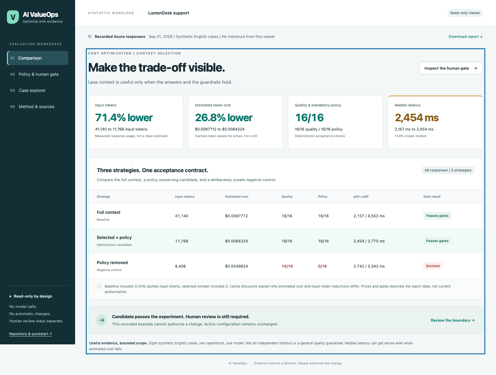
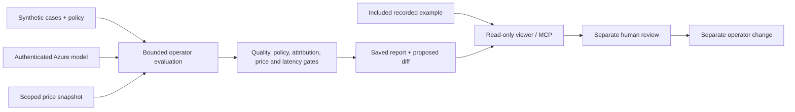
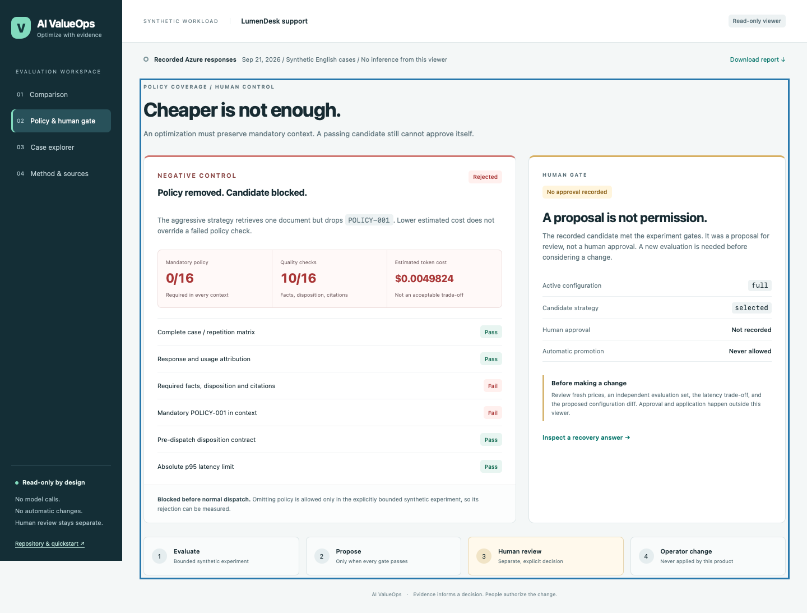

# AI ValueOps

**Evaluate AI cost optimizations against quality and policy checks before a human approves a change.**

AI ValueOps helps AI engineers, platform teams and FinOps practitioners answer a practical question: *does a cheaper AI configuration still do the job safely?* It compares context strategies for a small support assistant, checks the actual answers and usage, and produces a reviewable proposal rather than changing the service.

- **Compare the whole trade-off:** input and cached tokens, estimated token cost, answer quality, policy coverage, and median / p95 latency.
- **Keep mandatory policy in context:** the selected strategy preserves it; a negative control demonstrates what gets rejected when it is removed.
- **Keep people in control:** evaluation can propose a configuration diff, but cannot approve, merge, deploy or apply it.
- **Inspect individual answers:** trace each result to a synthetic case, context document IDs and response telemetry.



*The actual local viewer, using the included recorded synthetic workload.*

## Try it in five minutes

Requires **Node.js 20+** and npm. No Azure account, API key, database or browser extension is needed.

```sh
git clone https://github.com/jrubiosainz/ai-valueops.git
cd ai-valueops
npm ci
npm run demo
```

Open **http://127.0.0.1:4311**. Start with **Comparison**, then open **Policy & human gate** and **Case explorer**. Press Ctrl+C to stop. If that port is occupied, use `PORT=4312 npm run demo`.

The default demo is an entirely local, read-only viewer of an **included recorded example on synthetic data**. Opening it makes **no model calls and no configuration changes**. The application has no runtime or development package dependencies; after obtaining the repository and Node, the demo works without a network connection.

## What the example shows

The fictional LumenDesk workload compares full context, selected context plus mandatory policy, and a negative strategy that removes policy. It contains eight English cases with two repetitions per strategy.

| Recorded result | Full context | Selected + policy | Policy removed |
|---|---:|---:|---:|
| Quality checks passed | 16/16 | 16/16 | 10/16 |
| Mandatory-policy checks passed | 16/16 | 16/16 | 0/16 |
| Input tokens | 41,140 | 11,768 | 8,456 |
| Cached input tokens | 31,616 | 0 | 0 |
| Estimated token cost, USD | $0.0087712 | $0.0064224 | $0.0049824 |
| Median / p95 latency, ms | 2,157 / 4,552 | 2,454 / 3,770 | 2,742 / 3,342 |
| Experiment outcome | Acceptable baseline | Propose for review | Blocked |

The selected strategy used **71.4% fewer input tokens** and had **26.8% lower estimated token cost**, but its **median latency was worse**. Costs use the recorded cached-token-aware retail prices, not invoices, realized savings or ROI. The cases informed development: this is **not an independent holdout**, statistical proof or a general quality guarantee.

The recording is dated September 21, 2026. Its answers, per-call measurements and aggregates are preserved; product metadata and paths are adapted. [`samples/recorded.json`](samples/recorded.json) contains the original report's SHA-256, recording date and transformation description. [`samples/recorded.sha256`](samples/recorded.sha256) identifies the **curated file**, not the original. No new Azure execution or human approval is claimed. Recorded price freshness and decisions describe that recording date, not permission to make a change today.

## Workflow



The active strategy stays **`full`** in [`config/service.json`](config/service.json). Only a complete, attributable live evaluation that meets every gate can produce a proposed `full` to `selected` diff. A recorded example or offline fixture cannot do so. Normal request preparation blocks missing mandatory policy **before dispatch**; the negative strategy is available only inside the bounded synthetic experiment.



*The policy and human-review boundary: a lower estimate is not permission to change the service.*

## Run and develop

```sh
npm test                   # Offline unit and integration tests
npm run build              # Build the recorded viewer into dist/
npm start                  # Serve dist/ on loopback
npm run evaluate:fixture   # Generate synthetic test responses; no cloud calls
```

Fixture reports go to ignored `.local/runs/`; they never overwrite the recorded sample. They use generated token/latency values, are labeled synthetic, and cannot justify a live change. To inspect one, use `npm run build -- --report .local/runs/<run-id>.json`, replacing `<run-id>` with the generated filename, then `npm start`.

| Path | Purpose |
|---|---|
| `src/` | Retrieval, answer checks, evidence calculations, viewer and read-only MCP server |
| `public/` | Dependency-free English UI and static-host headers |
| `samples/` | Fictional handbook, acceptance cases, recorded measurements and price example |
| `config/` | Evaluation contract, active strategy and live-evaluation price snapshot |
| `scripts/` | Build, bounded evaluation, price capture and optional deployment |
| `test/` | Offline regression, attribution, policy, pricing, API and provenance checks |
| `infra/` | Optional parameterized, keyless Azure OpenAI Bicep template |

## Optional Azure evaluation and deployment

Use your own authorized Azure scope and an existing compatible deployment. Start with [`.env.example`](.env.example), review the contract, refresh the public price snapshot, and commit the evaluator inputs. A live run requires both `--live` and an explicit inference opt-in. It is bounded to 48 requests, 160,000 total tokens and 15 minutes by the default contract; errors stop the run rather than retrying silently.

See **[the Azure operator guide](docs/azure.md)** for setup, authentication, price refresh, evaluation, and optional `--what-if` / `--apply` deployment commands. No Azure resources are required for the offline experience. The optional deployment does not create a resource group or grant roles.

`dist/` is a static read-only site and can be hosted independently. Review its report and configure the host to preserve the read-only methods, MIME types and security headers; the included configuration supports Azure Static Web Apps. Hosting a viewer does not expose an inference endpoint.

## Agent-assisted review

The [read-only MCP workflow](docs/agent-workflow.md) lets GitHub Copilot App or another compatible local client inspect the included context and recording. Its three tools only read context, report summaries or a known case. They cannot execute commands, call a model, approve a change or accept arbitrary file paths.

## Scope

This is a focused reference product for **synthetic English support workloads**, not a general production optimizer. It supports three context strategies, deterministic acceptance checks and one pinned model/price adapter. Identity-recovery routing is an English intent rule with limited coverage, not a general policy classifier. Check model availability and retirement before a live run; no replacement is selected automatically. GlobalStandard inference does not guarantee processing in the account's region.

See [architecture](docs/architecture.md), [contributing](CONTRIBUTING.md) and [security](SECURITY.md). No project license has been selected; source availability does not by itself grant a reuse license.
